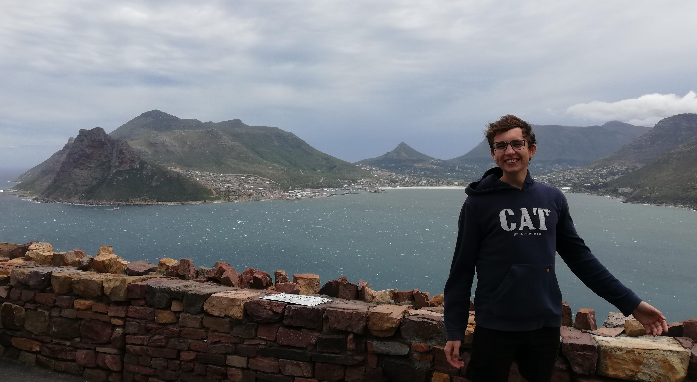

---
# Feel free to add content and custom Front Matter to this file.
# To modify the layout, see https://jekyllrb.com/docs/themes/#overriding-theme-defaults

layout: custom-home
---

<h1>Hi, I'm Willie Loftie-Eaton</h1>

## About Me
I am a BSc Hons Computer Science student at the University of Stellenbosch. I
enjoy studying Computer Science, Mathematics, and Statistics. In my free time I
practice guitar, read, play ultimate frisbee, and run. I would like to have an
impactful career and hence I try to organize my life such that I gather useful
skills, and learn about cool problems to tackle (energy abundance seems
interesting). I'm interested in making civilization last as long as possible.
I'm always looking for friends, so feel free to reach out if you want to chat.

To know more about me, you can visit my [blog](./blog)
where I will share things that interest me.  
You can view my CV on [this page](./cv) or download a PDF version [here](/assets/cv/Willie_Loftie-Eaton_CV.pdf).

*** 

## My Work
[Demo E-commerece app](https://github.com/willieloea/ecommapp)  
During vacation in January 2024, I learned how to build a web-app using the MERN
(mongoDB, Express.js, React.js, Node.js) stack. 
As of yet, the repo isn't 'presentation ready', but the app was able to allow
users to see products stored on a database, add items to a cart, and send a
WhatsApp message through Twillio, notifying the owner what was in the cart.

[CAlab](https://github.com/willieloftieeaton/CAlab)  
The goal of this project is to enable computations and visualizations of
Cellular Automata. It is something I work on in my free time, and at the moment
is capible of computing 1-dimensional Cellular Automata.

[This website](https://github.com/willieloftieeaton/willieloftieeaton.github.io)  
This website serves to inform you about me, and is a place where I can share my ideas and work with the world.
